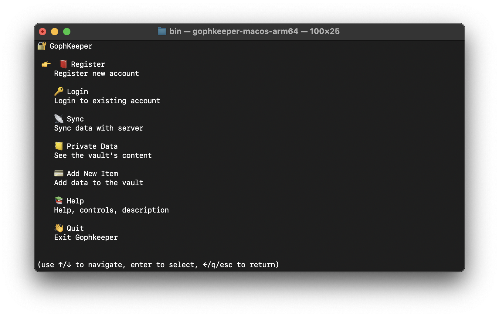
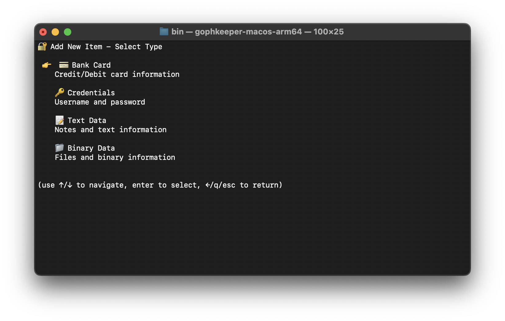
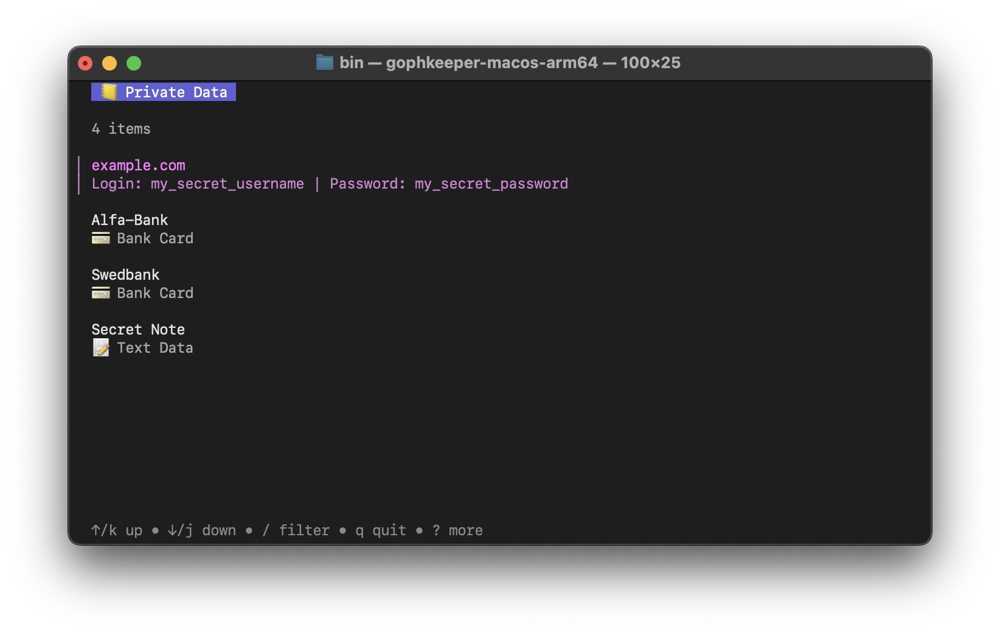

# 🛡️ GophKeeper

---

A secure **cross-platform password and secrets manager** written in **Go** with a **TUI** client and **gRPC** server.  
The goal is to provide a **privacy-first, self-hosted alternative** for managing sensitive data (passwords, bank cards, notes, binary files) with strong cryptography and synchronization between devices.

For more details, see the [Technical Specification](TECH_SPEC.md).

---

## ✨ Features

- 🔑 **Secure data storage** (credentials, bank cards, text notes, binary files)
- 🔒 **End-to-end encryption** using **AES-GCM**, **Argon2id**, and **Ed25519**
- 🖥️ **Terminal UI (TUI) client** built with [Bubble Tea](https://github.com/charmbracelet/bubbletea)
- 🌍 **gRPC server** with TLS and JWT authentication
- 🔄 **Two-way synchronization** between client and server
- 🗄️ **SQLite (SQLCipher)** on client, **PostgreSQL** on server
- 🐳 Fully containerized via **Docker & Docker Compose**
- ⚡ Domain-driven design (DDD) and clean architecture principles
- 🧪 Full test coverage for critical cryptographic and sync logic
- 📦 Cross-platform builds (Linux, macOS, Windows) with **GitHub Actions CI/CD**

---

## 🏛️ Architecture

```
   ┌───────────────────────┐       ┌───────────────────────┐
   │        Client         │       │        Server         │
   │  - TUI (BubbleTea)    │  gRPC │  - Auth (JWT, HMAC)   │
   │  - Local SQLite (E2EE)│ <────>│  - Sync (Postgres)    │
   │  - Sync (outbox/inbox)│       │  - User management    │
   └───────────────────────┘       └───────────────────────┘
```

- **Client** keeps all data locally encrypted (SQLCipher).
- **Server** only sees encrypted payloads and manages synchronization.
- **gRPC APIs** expose Auth, Sync, and Data operations.

---

## 🧩 Technologies & Tools

- **Language**: Go 1.25+
- **UI**: [Charm BubbleTea](https://github.com/charmbracelet/bubbletea)
- **Database**:
    - Client → SQLite + SQLCipher
    - Server → PostgreSQL + pgx
- **Protocols**: gRPC, TLS 
- **Crypto**: AES-GCM, Argon2id, Ed25519, HMAC (SHA-256/512)
- **DevOps**: Docker, Makefile, GitHub Actions (multi-platform builds)

---

## 🧭 Philosophy & Strategy

- **Security-first**: All data is encrypted *before* leaving the client. Server never sees plaintext.
- **Simplicity**: Minimal dependencies, clean Go code, simple TUI.
- **Portability**: Cross-platform clients, self-hosted server.
- **Resilience**: Sync designed with *cursor + outbox pattern* to tolerate offline work.
- **Transparency**: Open-source, with clear boundaries between crypto, domain, and infra.
- **Testability**: Core logic covered with unit tests; interfaces for crypto/storage for easy mocking.

---

## 📸 Screenshots





---
